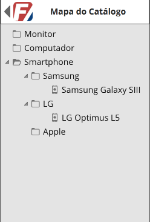

# Catalog Viewer

Class: **EEL 970 - Software para Smartphone**

Professor: **Sergio Barbosa Villas-Boas**

Aluno: **Fernando Pinheiro**

---

## Problem Definition
Comercial establishments in general still don't have a simple and accessible way to view their available products catalog.  

To create a solution that will let their catalog accessible for their target and potential costumers can definitely be
an effective way to raise their sales and possibly answer the costumers's doubts about the establishment and it's products.
 
## Solution
Develop an application to make commercial establishments' products catalog available in mobile devices.

## Product Overview

The application will be developed for the Android system, and it's main focus will be smartphones.

### Assumptions and Dependencies

This project assumes that the establishment in question will maintain its products catalog updated.

### Mandatory Requirements

+ The application should be able to register the products catalog of any comercial establishment. 

+ The catalog's structure should be in tree, where each node will be a product's category and each leaf will be a product. 

+ The application should be able to update the previously registered products catalog. 

+ The application should be able to show the previously registered products catalog.

+ The application should be able to show the details of each product in the catalog.

### Extras Requirements

+ Usability: the application interface should be focused in fast performance and pleasant user interaction design.

---

## Features

### Register Catalog

This feature allows the registration of an establishment's catalog.

The registration will be done manually by the project manager together with the establishment owner, that should supply
the required material so that the catalog can be built.

The catalog's registration will be represented by a xml file containing it's tree structure, and an image folder
containing its products images.

#### Main Flow

1. Prepare the catalog's structure together with the establishment owner.
2. Build the xml file containing the catalog's structure.
3. Gather the required material with the establishment owner.
4. Create the image folder.
5. Compress the xml file together with the image folder in zip format.

#### XML structure

The xml will have the following structure:
	
	<xml ...>
	<catalog>
		<title>título</title>
		<category>
			<name>categoria1</name>
			<item>
				<name>nome1</name>
				<photo>nome1.jpg</photo>
				<description>description1...</description>
			</item>
		</category>
		<category>
			<name>categoria2</name>
			<category>
				<name>categoria3</name>
				<item>
					<name>nome3</name>
					<photo>nome3.jpg</photo>
					<description>description3...</description>
				</item>
			</category>
			<item>
				<name>nome2</name>
				<photo>nome2.jpg</photo>
				<description>description2...</description>
			</item>
		</category>
	</catalog>

In other words, each category contains several items or yet other categories.

---

### Show Catalog

This feature allows the user to view the catalog generated by the feature Register Catalog.

The catalog's exhibition will be made item by item on the home screen of the application, as we can see in the following
figure.

#### Main Flow

1. Load the catalog's data.
2. Show the products in the application's home screen.
3. Allow navigation between products of the application's home screen.

---

### Show Catalog's Map

This feature allows the visualization of the catalog in a tree structure. The catalog's map view is accessible through
the feature Show Catalog.

#### Main Flow

1. In the Show Catalog use case, the user wishes to view the catalog's map.
2. The catalog's tree view screen is showed, as we can see in the following figure.

---

### Show Product's Details

This feature allows you to view the details of a product registered in the catalog. The product's detail view will be
accessible through the feature Show Catalog and Show Catalog's Map.

#### Main Flow

1. In the Show Catalog use case or in the Show Catalog's Map use case, the user wishes to view a product's details.
2. A screen appears with all the product details, as illustrated by the prototype below.

