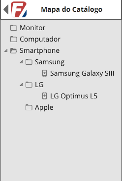

# Catalog Viewer

Class: **EEL 970 - Software para Smartphone**

Professor: **Sergio Barbosa Villas-Boas**

Aluno: **Fernando Pinheiro**

---

## Definição da Necessidade
Estabelecimentos comerciais em geral ainda não possuem uma maneira simples e acessível para visualização de seus 
produtos disponíveis em catálogo.

Criar uma solução que torne disponível o catálogo de um estabelecimento aos seus potenciais clientes aumentará suas 
vendas e possivelmente esclarecerá as dúvidas dos clientes em relação ao estabelecimento e seus produtos.

## Solução
Desenvolver uma aplicação para tornar o catálogo de produtos de determinado estabelecimento comercial disponível em 
dispositivos móveis.

## Visão Geral do Produto

A aplicação será desenvolvida para o sistema Android, tendo seu foco em smartphones.

### Premissas e Dependências

Este projeto assume como premissa que o estabelecimento em questão manterá atualizado seu catálogo de produtos que será
exibido pela aplicação.

### Requisitos Obrigatórios
 
+ A aplicação deve ser capaz de cadastrar o catálogo de produtos de qualquer estabelecimento comercial.

+ A estrutura do catálogo deverá ser em árvore, onde cada nó será uma categoria de produto e cada folha será um produto.

+ A aplicação deve ser capaz de atualizar o catálogo de produtos já cadastrado.

+ A aplicação deve ser capaz de exibir o catálogo de produtos previamente cadastrado.

+ A aplicação deve ser capaz de exibir os detalhes de cada produto no catálogo.

### Requisitos Extras

+ Usabilidade: a interface da aplicação deve ser focada na rápida performance e design agradável ao usuário.

---

## Funcionalidades

### Cadastrar Catálogo

Este caso de uso permite o cadastro do catálogo do estabelecimento.

O cadastro será feito manualmente pelo responsável do projeto e acompanhado pelo representante do estabelecimento, que deve fornecer o material necessário para construção do catálogo.

O cadastro de um catálogo será representado por um arquivo xml contendo sua estrutura em árvore, e uma pasta com as imagens de cada produto.

#### Fluxo principal

1. Preparar a estrutura do catálogo junto ao representante do estabelecimento.
2. Construir o arquivo xml contendo a estrutura do catálogo.
3. Aquisição do material necessário junto ao representante do estabelecimento.
4. Criar a pasta de imagens.
5. Comprimir arquivo xml juntamente com a pasta de imagens no formato zip.

#### Estrutura do xml

O xml terá a seguinte estrutura:
	
	<xml ...>
	<catalog>
		<title>título</title>
		<category>
			<name>categoria1</name>
			<item>
				<name>nome1</name>
				<photo>nome1.jpg</photo>
				<description>description1...</description>
			</item>
		</category>
		<category>
			<name>categoria2</name>
			<category>
				<name>categoria3</name>
				<item>
					<name>nome3</name>
					<photo>nome3.jpg</photo>
					<description>description3...</description>
				</item>
			</category>
			<item>
				<name>nome2</name>
				<photo>nome2.jpg</photo>
				<description>description2...</description>
			</item>
		</category>
	</catalog>

Ou seja, cada categoria possui items ou outras categorias.

---

### Exibir Catálogo

Este caso de uso permite a exibição do catálogo gerado pelo caso de uso Cadastrar Catálogo.

A exibição do catálogo será feita de item a item, na tela inicial do aplicativo, como na figura a seguir.

#### Fluxo Principal

1. Carregar dados do catálogo.
2. Exibir produtos na tela inicial no aplicativo.
3. Permitir navegação entre os produtos na página inicial do aplicativo.

---

### Exibir mapa do catálogo

Este caso de uso permite a visualização do mapa do catálogo em estrutura de árvore. A exibição do mapa do catálogo é acessível através do caso de uso exibir catálogo.

#### Fluxo principal

1. No caso de uso de exibir catálogo, o usuário indica que deseja visualizar o mapa do catálogo.
2. É exibida tela com mapa do catálogo em árvore, como ilustra o protótipo abaixo.

---

### Exibir Detalhes do Produto

Este caso de uso permite a exibição dos detalhes de um produto cadastrado no catálogo. A exibição dos detalhes do produto será acessível através do caso de uso exibir catálogo e exibir mapa do catálogo.

#### Fluxo Principal

1. No caso de uso exibir catálogo, o usuário indica que deseja visualizar os detalhes do produto. Ou, no caso de uso exibir mapa do catálogo, o usuário indica que deseja visualizar os detalhes do produto.
2. É exibida uma tela com todos os detalhes do produto, como ilustra o protótipo abaixo.

